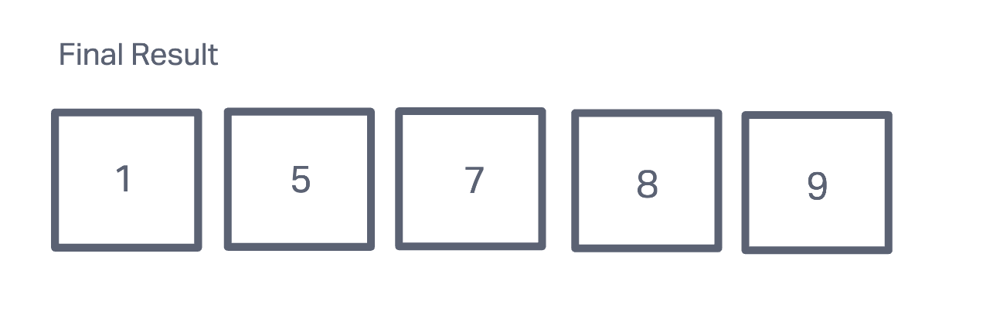

# Insertion Sort

### What is a Insertion Sort?
- A method of sorting elements by comparing it to the prvious elements in an array.

Let's go ahead and look at a step by step summary o how this works.

### Step 1:

- Here there is a set of values that are not in ascending order. Evetnually at the end of this we will want the number in this list to show an ascending order.
- So in this we will check if the number 5 is greater than 7 in this case an see if this is true or not. If it's smaller than it will ignore that and proceed to the next value in the list.

### Step 2:

- Here the next part will then compare the numbers of the next set like 7 and 8. From there these will go through the while loop to find if the integer that is next in the sequence. 
- The 7 will compare with number 8 to reveal that the 8 is larger and have integer stay in the same spot.

### Step 3:

- The number that stays is the number 7 and the whle loop will then check the next number in the list. From here we see that 8 is less than 9 causing the number to stay in the sequence.
- This will then go through to verfiying to the last final digit.

### Step 4:

- Here the last number is 1 and in the while loop this will test whether or not this temp number is actually greater than the value that it's being compared to. From there it will then go down the line until is verifies that it is true.

### Step 5:

- In the last list there is the final insertion sort where the number are in ascedning order after exiting the while loop.
