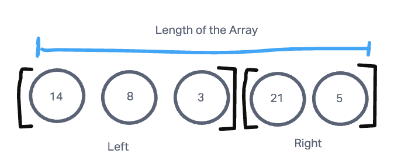
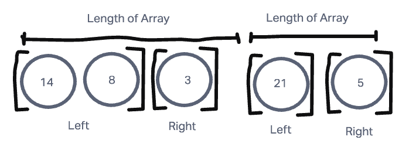
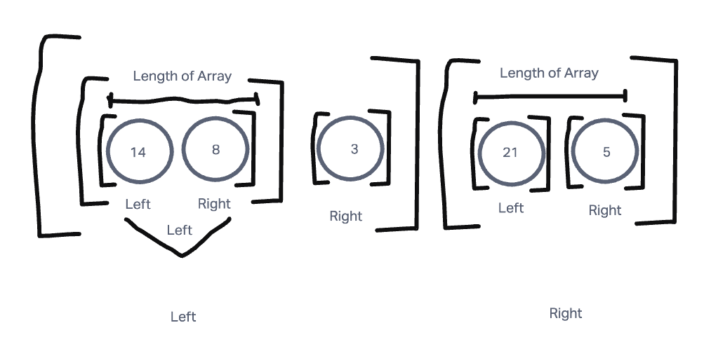
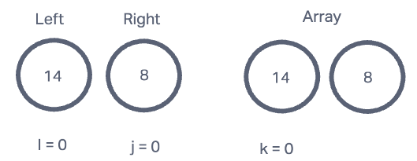
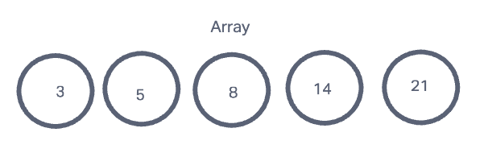

# Merge Sort

### What is a Merge Sort? 

- A merge sort is a way of dividing and putting together an array using two different alogrithms.

### Here is an example to explain.
Step 1:

- One array with the left and right symbolizing the division to start the recursion.

Step 2:

- In this steps we see the division happenning right away between right and left of two new arrays. 

Step 3:

- This is the whole process for the recursion that will be happenning. In this you can see the recursive process with arrays being divided into right and left arrays.

Step 4:

- Here we start with the smallest part of the array elements. Using the key of letter like j, k, and i. This will basically compare the values on the left and right until we get the final product of our array showing it from a ascending order. 

Step 5:

- In the final step you can see the final result of how the array would look once this has gone through and produces an array in a ascending order. 

