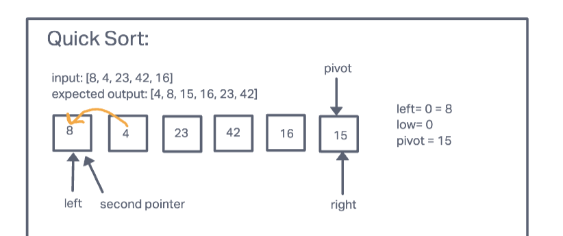
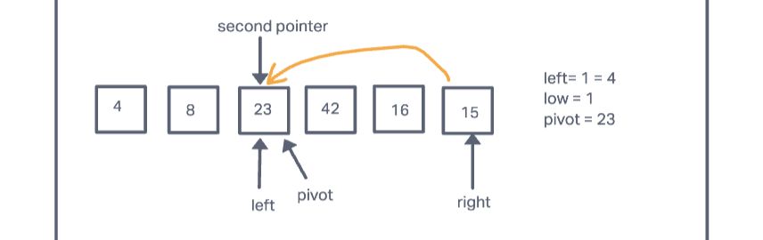
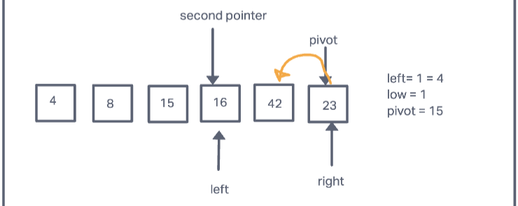

# Quick Sort

[PR Link](https://github.com/bran2miz/data-structures-and-algorithms/pull/70)

Quick Sort does the opposite of merge sort in that it will compare the left to the pivot number, and all the integers through the array in between. If one of the integers is less than the pivot, that position is "swapped" with the left integer(or the second pointer). However, if none of the numbers in between are less than the pivot, that pivoted integer will switch with the left at whatever index. This will continue until all numbers are sorted and in sequential order.

## Challenge Summary

Review the pseudo code, then trace the algorithm by stepping through the process with the provided sample array. Document your explanation by creating a blog article that shows the step-by-step output after each iteration through some sort of visual.

Once you are done with your article, code a working, tested implementation of Quick Sort based on the pseudo code provided.

## Pseudo Code

```python
ALGORITHM QuickSort(arr, left, right)
    if left < right
        // Partition the array by setting the position of the pivot value
        DEFINE position <-- Partition(arr, left, right)
        // Sort the left
        QuickSort(arr, left, position - 1)
        // Sort the right
        QuickSort(arr, position + 1, right)

ALGORITHM Partition(arr, left, right)
    // set a pivot value as a point of reference
    DEFINE pivot <-- arr[right]
    // create a variable to track the largest index of numbers lower than the defined pivot
    DEFINE low <-- left - 1
    for i <- left to right do
        if arr[i] <= pivot
            low++
            Swap(arr, i, low)

     // place the value of the pivot location in the middle.
     // all numbers smaller than the pivot are on the left, larger on the right.
     Swap(arr, right, low + 1)
    // return the pivot index point
     return low + 1

ALGORITHM Swap(arr, i, low)
    DEFINE temp;
    temp <-- arr[i]
    arr[i] <-- arr[low]
    arr[low] <-- temp
```

Sample Array:

```python
[8,4,23,42,16,15]
```

### Pass 1



The first step will verify whether the left[0] is less than the right[5]. Left[0] = 8 is less than Right[5] = 15 so the condition is met. A second pointer is then created at left[0]. We then define the position variable as being equal to the Partition function. Elements less than the pivot are kept on the left side and elements greater than pivot are on the right side of the pivot. This is showcased at the end of our QuickSort function.

The partition function (arr, left, right) defines the pivot as the array[right] = arr[5] = 15. We then define low is equal to left = 0 -1 = -1. A for loop is entered only when the conditional, if i is between left and right, is true. If the arr[i] is less than or equal to the pivot = 15, we will then increment the low. Due the fact that within the array, there is a number that is less than 15 (integer at the index of 1 = 4), we will then increment the low = -1 + 1 = 0, and then the swap function is now invoked.

The swap function will first take in the array, i = 1, and the low= -1. We then define the temp as the arr[i=1] = 4. The arr[low is now 0] = 8 is now replacing the arr[1] = 4. Now temp is equal to 8. We then increment the low = 0 +1 = 1. The quick sort method will now adjust the second pointer and the pivot for the new pass.

Pivot = 15
     pivot
4  8// 23 [15] 42, 16

New Pass: [4,8,23,42,16,15]

### Pass 2


The first step will verify whether the left[1] is less than the right[5]. Left[1] = 8 is less than Right[5] = 15 so the condition is met. A second pointer is then created at left[1]. We then define the position variable as being equal to the Partition function. Elements less than the pivot are kept on the left side and elements greater than pivot are on the right side of the pivot. This is showcased at the end of our QuickSort function.

The partition function (arr, left, right) defines the pivot as the array[right] = arr[5] = 15. We then define low is equal to left = 1 -1 = 0. A for loop is entered only when the conditional, if i is between left and right, is true. If the arr[i] is less than or equal to the pivot = 15, we will then increment the low. Since there are no integers at any index within the array that is less than the pivot, we then skip the Swap function and increment the low = 0 +1 = 1.

New Pass: [4, 8, 23, 42, 16, 15]

### Pass 3



The first step will verify whether the left[2] is less than the right[5]. Left[2] = 23 is not less than Right[5] = 15 so the condition is not met. The second pointer is at left[2]. It is here that we skip to the partition method. We define pivot as the arr[5]= 15. The condition for the if statement is not met due to the fact that there are no remaining integers that are less than the pivot. It is here that the we invoke the swap method, with arr = [], i = right[5] = 15, and low = 1 + 1 = 2. We set the arr[5] = 15 as the new temp. The arr[low = 2] = 23 is now replacing the arr[5] = 15. We then set our new temp value as the arr[2] = 15. We now have [4, 8, 15] in the our temp array. We then return our low = 2 + 1 = 3. The quick sort method will now adjust the second pointer and the pivot for the new pass.

Pivot = 23
     pivot
4  8 15// [23] 42, 16

New Pass: [4, 8, 15, 42, 16, 23]

### Pass 4


The first step will verify whether the left[3] is less than the right[5]. Left[3] = 42 is not less than Right[5] = 23 so the condition is not met. The second pointer is at left[3]. It is here that we skip to the partition method.

The partition function (arr, left, right) defines the pivot as the array[right] = arr[5] = 15. We then define low is equal to left = 3 -1 = 2. A for loop is entered only when the conditional, if i is between left and right, is true. If the arr[i] is less than or equal to the pivot = 23, we will then increment the low. Due the fact that within the array, there is a number that is less than 23 (integer at the index of 4 = 16), we will then increment the low = 2 + 1 = 3, and then the swap function is now invoked.

The swap function will first take in the array, i = 4, and the low= 3. We then define the temp as the arr[i=4] = 16. The arr[low is now 3] = 42 is now replacing the arr[4] = 16. Now temp is equal to 15. We then increment the low = 3 +1 = 4. We now have [4, 8, 15, 16] in the our temp array.The quick sort method will now adjust the second pointer and the pivot for the new pass.

Pivot = 23
     pivot
4  8 15 16//[23] 42

New Pass: [4, 8, 15, 16, 42, 23]

### Pass 5



The first step will verify whether the left[4] is less than the right[5]. Left[4] = 42 is not less than Right[5] = 23 so the condition is not met. The second pointer is at left[4]. It is here that we skip to the partition method. We define pivot as the arr[5]= 23. The condition for the if statement is not met due to the fact that there are no remaining integers that are less than the pivot. It is here that the we invoke the swap method, with arr = [], i = right[5] = 23, and low = 3 + 1 = 4. We set the arr[5] = 23 as the new temp. The arr[low = 4] = 42 is now replacing the arr[5] = 23. We then set our new temp value as the arr[4] = 23. We now have [4, 8, 15, 16, 23] in the our temp array. We then return our low = 4 + 1 = 5. The quick sort method will now adjust the second pointer and the pivot for the new pass.

Pivot = 42
     pivot
4  8 15 16 23// [42]

New Pass: [4, 8, 15, 16, 23, 42]

### Pass 6


The first step will verify whether the left[5] is less than the right[5]. Left[5] = 42 is not less than Right[5] = 42 so the condition is not met. The second pointer is at left[5]. It is here that we skip to the partition method. We define pivot as the arr[5]= 42. The condition for the if statement is not met due to the fact that there are no remaining integers that are less than the pivot. It is here that the we invoke the swap method, with arr = [], i = right[5] = 42, and low = 4 + 1 = 5. We set the arr[5] = 42 as the new temp. The arr[low = 5] = 42 is now replacing the arr[5] = 42. We then set our new temp value as the arr[5] = 42. We now have [4, 8, 15, 16, 23, 42] in the our temp array. The quick sort method will now adjust the second pointer and the pivot for the new pass. The code will now stop running because we have no more values in the array left.

Pivot = 42
     pivot
4 8 15 16 23 42 //

New Pass: [4, 8, 15, 16, 23, 42]

## Approach and Efficiency

The approach that I took was to first figure out what exactly was a quick sort method and how it worked. Using several helpful information from classmates and the lovely internet, I was able to figure out how it all works.

The Big O space is O(log n), due to the fact that number of temp variables that are made is proportional to the number of recursions. The Big O time would be O(n^2), because it only happens when the pivot value is either highest or lowest element in the array.

## Credits and Collaborators

[Source 1](https://www.programiz.com/dsa/quick-sort)

Eddie Ponce, Brandon Mizutani, Alex Payne
